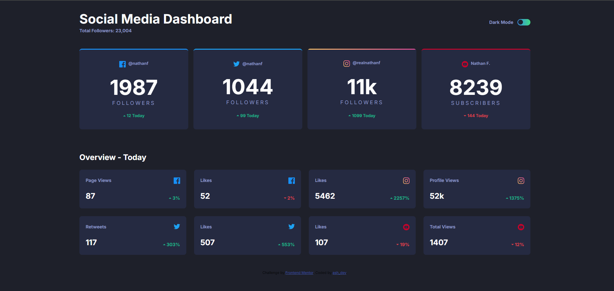

# Frontend Mentor - Social media dashboard with theme switcher solution

This is a solution to the [Social media dashboard with theme switcher challenge on Frontend Mentor](https://www.frontendmentor.io/challenges/social-media-dashboard-with-theme-switcher-6oY8ozp_H). Frontend Mentor challenges help you improve your coding skills by building realistic projects. 

## Table of contents

- [Overview](#overview)
  - [The challenge](#the-challenge)
  - [Screenshot](#screenshot)
  - [Links](#links)
- [My process](#my-process)
  - [Built with](#built-with)
  - [What I learned](#what-i-learned)
  - [Continued development](#continued-development)
  - [Useful resources](#useful-resources)
- [Author](#author)

## Overview

### The challenge

Users should be able to:

- View the optimal layout for the site depending on their device's screen size
- See hover states for all interactive elements on the page
- Toggle color theme to their preference

### Screenshot



### Links

- Live Site URL: (https://dashboard-darklightoggle.vercel.app)

## My process

I used vite in creating this practice project. The first thing I did was to analyze the design file and plan how I can implement the components needed. Once I was done with research, I created a vite project and utilized the provided html for the content. Then I started regrouping the elements I thought belongs to the same group to make my layout. After that, I added class to the elements. Then I proceeded with styling. I separated each section with their own css files to avoid clutter and keep the code organized. I used the mobile-first approach as I find it easier to handle. After I wrote the uniform layout styling to the elements, that's when I wrote the code for the themes which include the colors. Then, I added the corresponding javascript for handling the toggle switch for the themes.

### Built with

- Semantic HTML5 markup
- CSS custom properties
- Flexbox
- CSS Grid
- Mobile-first workflow

### What I learned

This is the first time I tried to style for both dark and light theme of a website. I learned how to handle a theme toggle using javascript DOM manipulation, and how to organize my css styling. I learned how to create custom styles that makes my work not repetitive and cluttered. 

Here's the method I used for the theme switch. I used uniform layout for positioning and sizing, but for the theme switch, I used 2 class and nested separate color styling for both theme.

```css
/* dark mode */
.dark { 
  background-color: var(--bg-dark);

  .header {
    background-color: var(--top-bg-dark);
  }

  .title, .overview-title {
    color: #fff;
  }

  /* ...rest of code */

}

/* light mode */
.light {
  background-color: var(--bg-light);

  .header {
    background-color: var(--top-bg-dark);
  }

  .title {
    color: #000;
  }

  .overview-title {
    color: var(--text-light);
  }

  /* ...rest of code */
}

```

### Continued development

There are still complex CSS stylings and javascript DOM manipulation I hope to implement on other projects. 

### Useful resources

- (https://www.example.com](https://www.w3schools.com/howto/howto_js_toggle_dark_mode.asp) - This helped me for the toggle function.
- (https://www.example.com](https://codepen.io/SaraSoueidan/pen/jpBbrq) - This is where I got the toggle switch component and modified it to the design requirement.

## Author

- Website - [TrishaCapitle](github.com/trishacapitle)
- Frontend Mentor - [@ytrishacapitle](https://www.frontendmentor.io/profile/trishacapitle)

